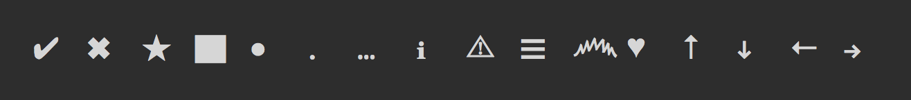

# figures-rs

Port of figures lib to rust
> Unicode symbols with Windows CMD fallbacks

## Figures

| Name               | Non-Windows | Windows |
| ------------------ | :---------: | :-----: |
| tick               |      ✔      |    √    |
| cross              |      ✖      |    ×    |
| star               |      ★      |   \*    |
| square             |      ▇      |    █    |
| squareSmall        |      ◻      |   [ ]   |
| squareSmallFilled  |      ◼      |   [█]   |
| play               |      ▶      |    ►    |
| circle             |      ◯      |   ( )   |
| circleFilled       |      ◉      |  (\*)   |
| circleDotted       |      ◌      |   ( )   |
| circleDouble       |      ◎      |   ( )   |
| circleCircle       |      ⓞ      |   (○)   |
| circleCross        |      ⓧ      |   (×)   |
| circlePipe         |      Ⓘ      |   (│)   |
| circleQuestionMark |     ?⃝      |   (?)   |
| bullet             |      ●      |   \*    |
| dot                |      ․      |    .    |
| line               |      ─      |    ─    |
| ellipsis           |      …      |   ...   |
| pointer            |      ❯      |    >    |
| pointerSmall       |      ›      |    »    |
| info               |      ℹ      |    i    |
| warning            |      ⚠      |    ‼    |
| hamburger          |      ☰      |    ≡    |
| smiley             |     ㋡      |    ☺    |
| mustache           |      ෴      |   ┌─┐   |
| heart              |      ♥      |    ♥    |
| nodejs             |      ⬢      |    ♦    |
| arrowUp            |      ↑      |    ↑    |
| arrowDown          |      ↓      |    ↓    |
| arrowLeft          |      ←      |    ←    |
| arrowRight         |      →      |    →    |
| radioOn            |      ◉      |  (\*)   |
| radioOff           |      ◯      |   ( )   |
| checkboxOn         |      ☒      |   [×]   |
| checkboxOff        |      ☐      |   [ ]   |
| checkboxCircleOn   |      ⓧ      |   (×)   |
| checkboxCircleOff  |      Ⓘ      |   ( )   |
| questionMarkPrefix |     ?⃝      |   ？    |
| oneHalf            |      ½      |   1/2   |
| oneThird           |      ⅓      |   1/3   |
| oneQuarter         |      ¼      |   1/4   |
| oneFifth           |      ⅕      |   1/5   |
| oneSixth           |      ⅙      |   1/6   |
| oneSeventh         |      ⅐      |   1/7   |
| oneEighth          |      ⅛      |   1/8   |
| oneNinth           |      ⅑      |   1/9   |
| oneTenth           |      ⅒      |  1/10   |
| twoThirds          |      ⅔      |   2/3   |
| twoFifths          |      ⅖      |   2/5   |
| threeQuarters      |      ¾      |   3/4   |
| threeFifths        |      ⅗      |   3/5   |
| threeEighths       |      ⅜      |   3/8   |
| fourFifths         |      ⅘      |   4/5   |
| fiveSixths         |      ⅚      |   5/6   |
| fiveEighths        |      ⅝      |   5/8   |
| sevenEighths       |      ⅞      |   7/8   |
